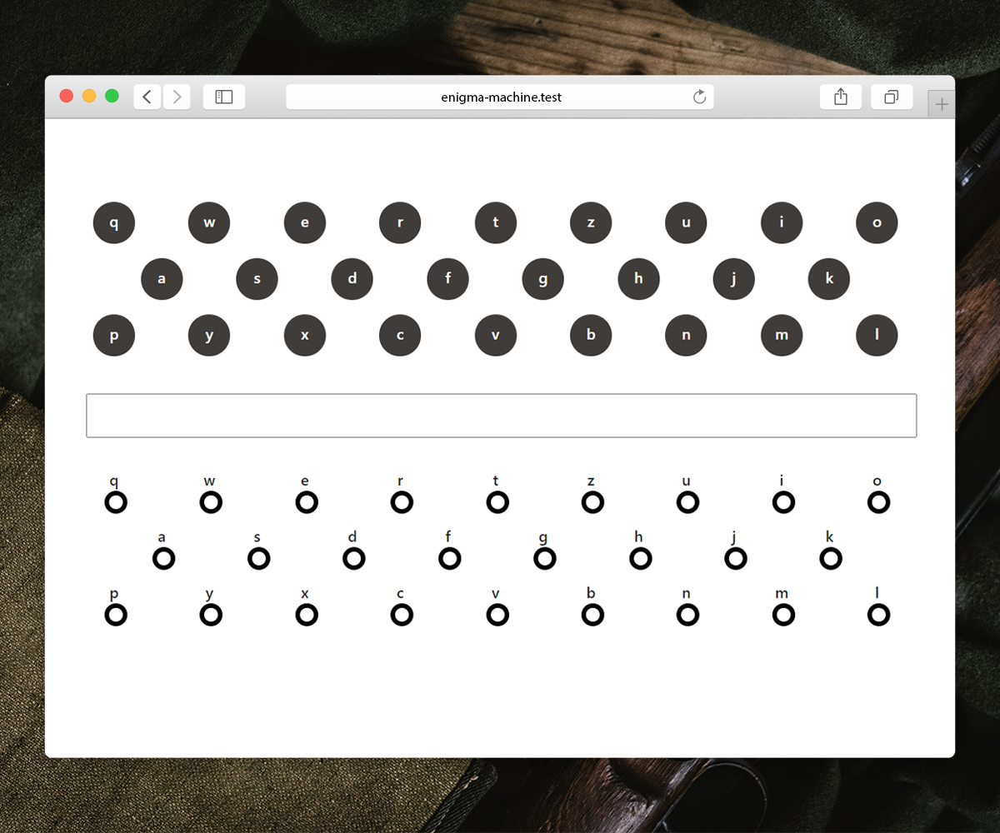

# Enigma Machine

This is a simulation of the Enigma Machine which is a cipher device. It was being used by the Nazi army during World War 2.



## Installation
Clone the repository.
```
git clone https://github.com/sadrahkm/Enigma-Machine
cd Enigma-Machine
```
Start php server.
```
php -S localhost:8000 -t .
```
Now you can visit the website on port 8000 of your localhost.

